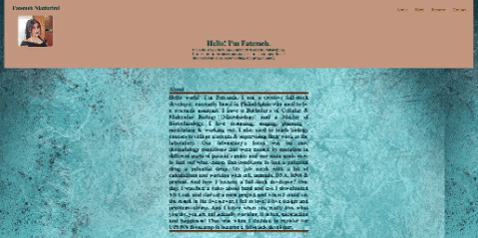

# portfolio


## Your Task

To creat portfolio which has different sections like navbar, header, etc. to showcase your skills to employers whose looking to hire a developer for either a full-time or part-time position. Biulding an impressive portfolio using advance Css and HTML which shows your talent and passion for writting the code.

 


## User Story

```
AS AN employer
I WANT to view a potential employee's work samples of deployed portfolio 
SO THAT I can check their work samples and assess if they are a good candidate for the open positions
```


## Acceptance Criteria
Requirements necessary to develop a portfolio that a typical hiring manager’s looking in the potential employee:

```
GIVEN I need to check work samples of a potential employee
WHEN I view their portfolio
THEN I am presented with the potential employee's name, a recent photo or avatar, and links located in navbar which is about them, their work, and how to contact them
WHEN I click one of these links in the navigation bar
THEN the UI scrolls and takes me to the corresponding section
WHEN I click on the link with the title of work
THEN the UI scrolls to a section with titled images of the developer's interest and work
WHEN I am presented with the developer's first application
Then by hovering on each application the imag will enlarge
when I click on each app or project
Then I will be taken to the functional page that app or project deployed 
THEN I am presented with a responsive layout that adapts to my viewport
```


## Mock-Up

The following animation shows the web application's appearance and functionality:




### Techniques

HTML & advance Css

## License

MIT License 2022. All Rights Reserved.
